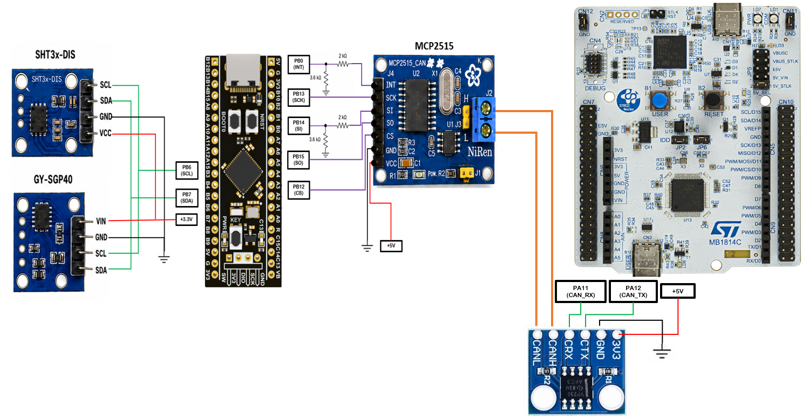
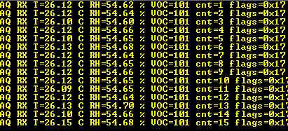

# System Overview

This document summarizes the hardware and firmware structure of the current working baseline.

## Project Goal

The project demonstrates a small distributed embedded system with two STM32 nodes connected over Classic CAN.

The sensor node measures air-quality-related values, calculates a VOC Index, packs the result into a compact CAN frame, and transmits it over the CAN bus.

The receiver node decodes the CAN frame and prints the values over UART.

## System Block Diagram

```text
+-----------------------------+
| BlackPill STM32F411         |
|                             |
|  SHT3x-DIS  -> I2C1         |
|  SGP40      -> I2C1         |
|                             |
|  air_quality_service        |
|  Sensirion VOC algorithm    |
|                             |
|  SPI2 -> MCP2515            |
+--------------+--------------+
               |
               | Classic CAN
               |
+--------------v--------------+
| Nucleo-F446RE               |
|                             |
|  CAN1 -> SN65HVD230         |
|  Decode CAN payload         |
|  USART2 -> PC terminal      |
+-----------------------------+
```

## Node 1: BlackPill Air Quality CAN Node

### Role

The BlackPill node is responsible for:

* Reading SHT3x-DIS over I2C
* Reading SGP40 over I2C
* Calculating VOC Index
* Packing the latest measurement into a CAN frame
* Sending the frame through MCP2515 over SPI

### Main Peripherals

| Peripheral | Usage                  |
| ---------- | ---------------------- |
| I2C1       | SHT3x-DIS and SGP40    |
| SPI2       | MCP2515 CAN controller |
| GPIO       | MCP2515 chip select    |
| EXTI       | MCP2515 interrupt pin  |

### Pin Summary

| Signal      | Pin  |
| ----------- | ---- |
| I2C1_SCL    | PB6  |
| I2C1_SDA    | PB7  |
| SPI2_SCK    | PB13 |
| SPI2_MISO   | PB14 |
| SPI2_MOSI   | PB15 |
| MCP2515_CS  | PB12 |
| MCP2515_INT | PB0  |

## Sensors and Sensor Drivers

### SHT3x-DIS

SHT3x-DIS is used as the temperature and relative humidity sensor.

In this project, it provides:

```text
temperature_c
humidity_rh
```

These values are used directly in the CAN measurement frame. They are also used as environmental compensation input for the SGP40 measurement.

Driver files:

```text
Core/Inc/sht3x.h
Core/Src/sht3x.c
```

The SHT3x driver provides a small interface for device initialization, I2C readiness checking, measurement-command generation, response parsing, CRC validation, and conversion from raw sensor ticks to physical temperature and humidity values.

Main functions:

```text
sht3x_init()
sht3x_is_ready()
sht3x_build_measure_command()
sht3x_parse_sample_response()
```

### SGP40

SGP40 is used as the VOC-related gas sensor.

The sensor does not directly provide a final VOC Index. It provides a raw VOC signal that is processed by Sensirion's Gas Index Algorithm.

Driver files:

```text
Core/Inc/sgp40.h
Core/Src/sgp40.c
```

The SGP40 driver provides device initialization, I2C readiness checking, command building for raw VOC measurement, response parsing, and CRC validation.

The driver also supports compensated SGP40 measurement commands using humidity and temperature ticks. These ticks are generated from the latest SHT3x measurement and are passed to the SGP40 measurement command.

Main functions:

```text
sgp40_init()
sgp40_is_ready()
sgp40_build_measure_raw_command_with_ticks()
sgp40_parse_sraw_response()
sgp40_read_sraw_voc_blocking()
```

### Sensirion Gas Index Algorithm

The VOC Index calculation is not implemented from scratch in this project. The project uses Sensirion's provided Gas Index Algorithm.

Algorithm files:

```text
Core/Inc/sensirion_gas_index_algorithm.h
Core/Src/sensirion_gas_index_algorithm.c
```

This algorithm receives the SGP40 raw VOC signal and produces the VOC Index used by the application.

## Air Quality Service

The BlackPill firmware contains an `air_quality_service` module.

Service files:

```text
Core/Inc/air_quality_service.h
Core/Src/air_quality_service.c
```

Its role is to coordinate the SHT3x and SGP40 measurements using a non-blocking state-machine style. It owns the low-level SHT3x and SGP40 driver contexts, manages persistent I2C transfer buffers, receives completion notifications from HAL I2C callbacks, and updates the latest application-level air-quality values.

Main functions:

```text
air_quality_service_init()
air_quality_service_check_ready()
air_quality_service_process()
air_quality_service_on_i2c_tx_complete()
air_quality_service_on_i2c_rx_complete()
```

The application layer uses the latest values exposed by the service:

```text
temperature_c
humidity_rh
sraw_voc
voc_index
voc_index_valid
voc_process_count
```

The CAN transmitter sends a new frame when a new VOC processing result is available.

## CAN Protocol Layer

The measurement values are packed into a compact Classic CAN frame by the project-specific air-quality protocol layer.

Protocol files:

```text
Core/Inc/air_quality_can_protocol.h
Core/Src/air_quality_can_protocol.c
```

This layer is responsible for converting the application values into the 8-byte CAN payload and decoding the same payload on the receiver side.

It handles:

* CAN ID and DLC definition
* Little-endian byte packing
* Temperature scaling to `temperature_c_x100`
* Humidity scaling to `humidity_rh_x100`
* VOC Index field encoding
* Sample counter field
* Status flags and protocol version bits

The detailed frame layout is documented in:

```text
docs/can_protocol.md
```

## MCP2515 CAN Interface

The BlackPill node uses an MCP2515 external CAN controller over SPI.

MCP2515 driver files:

```text
Core/Inc/MCP2515.h
Core/Src/MCP2515.c
```

The MCP2515 driver handles the controller-specific SPI communication and interrupt-driven CAN transmission flow.

It provides:

* MCP2515 reset and initialization
* Mode configuration, including Normal and Loopback modes
* CAN bitrate configuration
* CAN frame transmission through TXB0
* MCP2515 INT-pin handling through EXTI
* SPI transfer-complete handling
* TX-complete event handling
* Basic MCP2515 error-flag reading
* Optional ID filter configuration

Main functions:

```text
MCP2515_Init()
MCP2515_Set_Mode()
MCP2515_Send_Frame_IT()
MCP2515_EXTI_Handler()
MCP2515_SPI_TxRxCplt_Handler()
MCP2515_Read_Frame()
MCP2515_Take_Tx_Done()
MCP2515_Take_Error_Flags()
MCP2515_Is_Busy()
MCP2515_Get_CAN_IF_Backend()
```

### Generic CAN Interface

The project also contains a small generic CAN interface layer.

CAN interface files:

```text
Core/Inc/can_if.h
Core/Src/can_if.c
```

This layer defines a common `can_frame_t` structure and a small backend interface. The application can call generic functions such as `CAN_IF_Send()` without depending directly on whether the backend is MCP2515 over SPI or STM32 internal bxCAN.

Main functions:

```text
CAN_IF_Init()
CAN_IF_Send()
CAN_IF_Read()
CAN_IF_Take_Tx_Done()
CAN_IF_Is_Busy()
```

On the BlackPill node, the backend is provided by the MCP2515 driver.

Current MCP2515 configuration:

| Item               | Value       |
| ------------------ | ----------- |
| CAN type           | Classic CAN |
| Bitrate            | 125 kbit/s  |
| MCP2515 oscillator | 8 MHz       |
| Mode               | Normal      |

## Node 2: Nucleo-F446RE CAN UART Node

### Role

The Nucleo node is responsible for:

* Receiving CAN frames
* Checking whether a frame matches the air-quality protocol
* Decoding the payload
* Printing human-readable values over UART2

### Main Peripherals

| Peripheral | Usage                                  |
| ---------- | -------------------------------------- |
| CAN1       | CAN reception through SN65HVD230       |
| USART2     | PC terminal output through ST-LINK VCP |

### Pin Summary

| Signal    | Pin  |
| --------- | ---- |
| CAN1_RX   | PA11 |
| CAN1_TX   | PA12 |
| USART2_TX | PA2  |
| USART2_RX | PA3  |

### bxCAN Interface

The Nucleo node uses the STM32F446RE internal bxCAN peripheral.

bxCAN interface files:

```text
Core/Inc/bxcan_if.h
Core/Src/bxcan_if.c
```

The bxCAN interface adapts the STM32 HAL CAN peripheral to the generic `can_if` layer. It receives CAN frames from FIFO0, stores the latest received frame, and exposes it through the same generic CAN interface used by the application.

Main functions:

```text
BXCAN_IF_Init()
BXCAN_IF_Get_CAN_IF_Backend()
BXCAN_IF_On_Tx_Complete()
BXCAN_IF_On_Rx_Fifo0_Message_Pending()
```

The receiver firmware then uses the shared `air_quality_can_protocol` layer to decode the measurement frame and print the result over UART2.

## Firmware Data Flow

```text
SHT3x-DIS + SGP40
        |
        v
air_quality_service
        |
        v
temperature / humidity / VOC Index
        |
        v
air_quality_can_protocol
        |
        v
can_if
        |
        v
MCP2515 driver
        |
        v
CAN bus
        |
        v
Nucleo bxCAN receiver
        |
        v
can_if
        |
        v
air_quality_can_protocol decode
        |
        v
UART2 terminal output
```

## Images

### Wiring Diagram

The following diagram shows the hardware wiring used in the current working baseline.



### UART Output Sample

The following screenshot shows decoded air-quality measurements received by the Nucleo node and printed over UART2.


