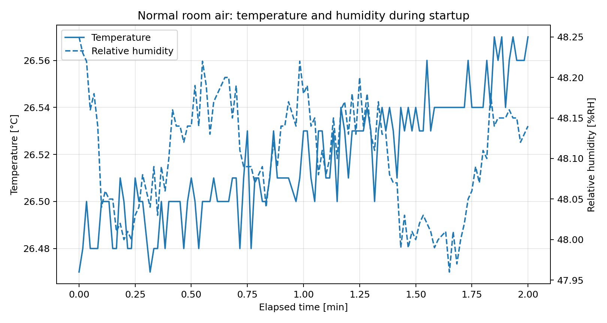
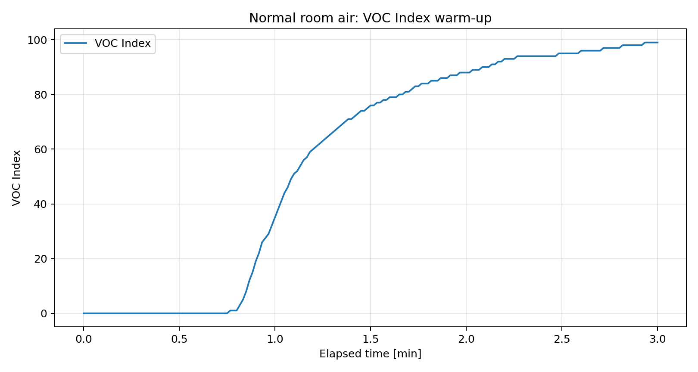
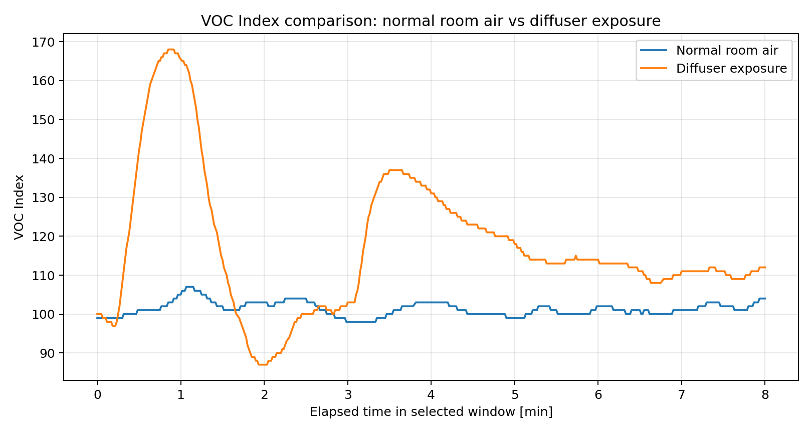
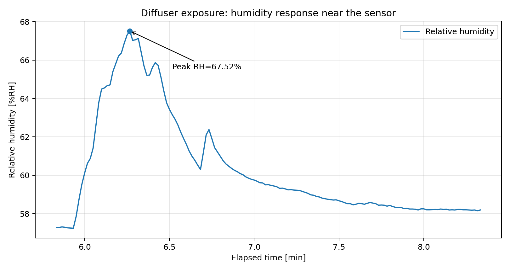

# Test Results

This document records the initial validation of the current working baseline.

The project workflow is tested as follows:

- The first CAN node, based on the BlackPill, MCP2515, SHT3x-DIS, and SGP40, measures temperature, relative humidity, and VOC-related gas data.
- The raw SGP40 signal is processed using Sensirion's Gas Index Algorithm to produce a VOC Index.
- The measured values are packed into a Classic CAN frame and transmitted over the CAN bus.
- The second CAN node, based on the Nucleo-F446RE and SN65HVD230, receives the CAN frame, decodes the payload, and prints the values over UART2.
- The printed UART data is captured and used here to check the behavior of the complete measurement and communication chain.

## Test Summary

The system was tested by measuring air-quality-related values in a living room under two conditions:

1. Normal room air without diffuser exposure. This case is used as a baseline.
2. The same room while using an aroma diffuser with essential oil. During the test, the diffuser was moved close to the sensor several times and then moved away again.

The goal of the test is not to calibrate the sensor against a reference instrument. The goal is to show that the complete STM32-to-STM32 CAN data path works and that the measured values react plausibly to environmental changes.

## Captured Data

| Capture | Description | Samples | Duration | Median update period |
|---|---|---:|---:|---:|
| `capture_normal.txt` | Normal room air | 974 | 999 s | 1.0 s |
| `capture_defuser.txt` | Aroma diffuser exposure | 1460 | 1498 s | 1.0 s |

Both captures show that the receiver node decoded and printed measurements at approximately 1 Hz.

## Results and Observations

### Normal Room Air: Temperature and Humidity

At startup, the system begins transmitting temperature and humidity values from the SHT3x-DIS sensor. In normal room air, both signals show only small variations during the selected startup window.

This plot is mainly used to show that the SHT3x-DIS measurement path is active and that the decoded CAN values are realistic for room conditions.

### Normal Room Air: VOC Index Warm-up

The VOC Index starts at 0 and then rises gradually toward the normal baseline region around 100.

This first rising part should be interpreted as an initial warm-up or baseline adaptation phase of the VOC Index algorithm, not as a sudden pollution event. After the initial phase, the normal-room capture stays close to a stable baseline. In this capture, the VOC Index after the first 180 seconds has an average value of about 101.2 with a standard deviation of about 1.6.

### VOC Index Response to Aroma Diffuser

The next plot compares VOC Index values in normal room air with a selected time window from the diffuser test. The initial VOC warm-up phase is skipped in both cases so that the comparison focuses on the environmental response.

The diffuser test shows a clear increase in VOC Index compared with the normal-room baseline. The maximum VOC Index in the diffuser capture is about 168, while the normal-room capture reaches about 107. This is consistent with the expected behavior when VOC-related substances from the aroma diffuser are brought close to the SGP40 sensor.

### Humidity Response to Aroma Diffuser

The aroma diffuser also affects relative humidity near the sensor. The following plot shows a selected window where the diffuser was close enough to cause a clear humidity rise.

The relative humidity reaches a peak of about 67.5 %RH in the diffuser capture. This confirms that the SHT3x-DIS humidity measurement also reacts to the local environmental change caused by the diffuser.
